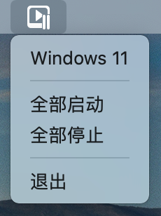
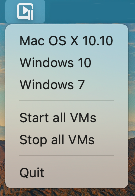

# PDrunner
适用于Parallels Desktop的虚拟机启动器  
A VM launcher for Parallels Desktop

## 使用 Usage
PDrunner是一个菜单栏APP, 启动后会在菜单栏显示一个图标.  
点击菜单栏图标可列出当前Mac上安装的所有客户机, 然后点击客户机名称即可启动对应的客户机.  
PDrunner will show an icon in the menu bar.  
Click icon to list all the VMs on your Mac, and click the name to start your VM.  

 

### 本项目仅用于学习研究使用, 请支持正版!