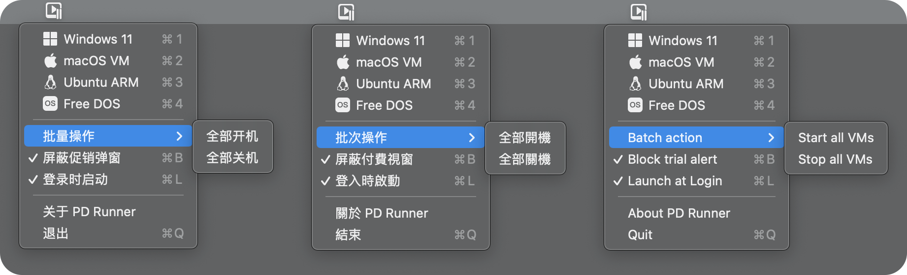

# 

<h1 align="center">PD Runner</h1>
<h3 align="center">适用于Parallels Desktop的启动器, 可无视试用期限强制启动客户机 (支持 PD17.1.0)</h3> 

本项目仅用于学习研究使用, 请支持正版! 
<a href="./README_en.md">English Version</a>

## 运行截图
  

## 使用
PD Runner是一个菜单栏APP, 启动后会在菜单栏显示程序图标. 点击菜单栏图标可列出当前Mac上安装的所有客户机, 然后点击客户机名称即可启动对应的客户机.  

## 常见问题
**1. 什么首次启动会需要输入密码?**  
> 因为针对PD 17.1.0新引入的鉴权措施, 需要通过快速切换系统时间来绕过. 所以需要向系统中安装一个特权助理, 方便进行修改时间的操作. 如果不这样做, 那么每次启动虚拟机的时候就都需要输入一次密码.  

**2. 为什么PD Runner启动后没有任何窗口?**  
> 因为PD Runner是一款菜单栏APP, 启动后只会在菜单栏显示一个图标以供使用, 并没有主窗口.  

**3. 虚拟机需要修改为指定的名称才能使用吗?**  
> 不需要, PD Runner可以全自动识别当前系统中的客户机, 并自动列出. 不要用户干预.  

**4. 安装帮助程序时弹出错误提示怎么办?**  

- 如果您看到的错误代码为"**Domain=CFError DomainLaunchd Code=9**"  

> 请尝试在系统的"终端"APP中执行以下命令, 并输入密码, 然后再次启动PD Runner既可正常使用 (输入密码的过程是不显示密码的, 并不是没有输入进去, 正常输入并回车既可)   
> `sudo launchctl enable system/com.lihaoyun6.PD-Runner-Helper`  

- 如果提示为"**"com.lihaoyun6.PD-Runner-Helper"将对您的电脑造成伤害。**"  
  

> 这是因为我使用的临时开发者证书过期所致, 可以使用诸如Clean My Mac的卸载工具卸载旧版本, 或使用Release中附带的"Uninstall-Helper"清除旧版残余项目, 然后重新打开PD Runner即可.  