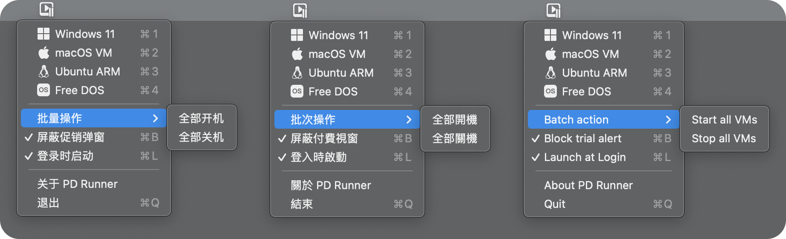
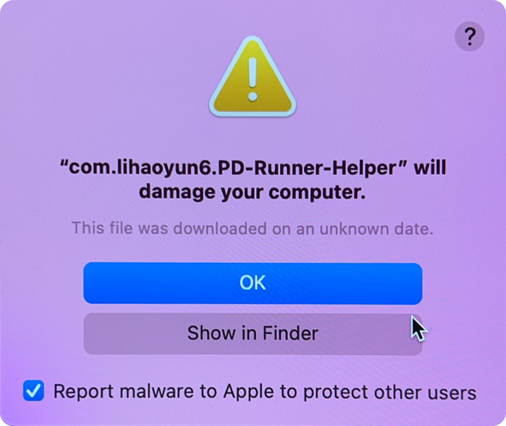

# 

<h1 align="center">PD Runner</h1>
<h3 align="center">A tool for Parallels Desktop can start VMs even the trial period has expired 
(Support for PD17.1.0 or earlier)</h3> 

Only for learning and research use, please support the genuine 
<a href="./README.md">中文版本</a>

## Screenshot
  

## Usage 
PD Runner will show an icon in the menu bar. Click menubar icon to list all the VMs on your Mac, then click on the vm you want to start. 

## Q&A
**1. Why do I need to enter a password when first run?**  
> Because of the new authentication measure introduced in PD 17.1.0, you need to bypass it by quickly switching the system time. A "Privileged Helper" needs to be installed on the system to change the time.  
> If you don't do this, you will need to enter the password every time you start an VM.  

**2. Why does PD Runner start without any windows?**  
>PD Runner is a menu-based application, it only show an icon in the menu bar for use after starting, and there is no main window.  

**3. Do I need to change the VM to a specific name to use it?**  
> No, PD Runner can automatically list the VMs in the current system automatically.  

**4. I get an error message when installing the helper**  

- If you see the error code "**Domain=CFError DomainLaunchd Code=9**"  

> Please run the following command in Terminal and enter the password. Then restart PD Runner and it will work normally.  
> `sudo launchctl enable system/com.lihaoyun6.PD-Runner-Helper`  

- If the system say "**「com.lihaoyun6.pd-runner-helper」 will damage your computer.**"  
  

> This is caused by the expiration of the temporary developer certificate I used. Use the "Uninstall-Helper" app included in the release to remove the residual items of the old version, and then reopen PD runner normally.  
> 